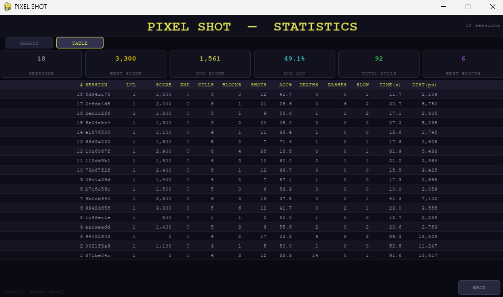
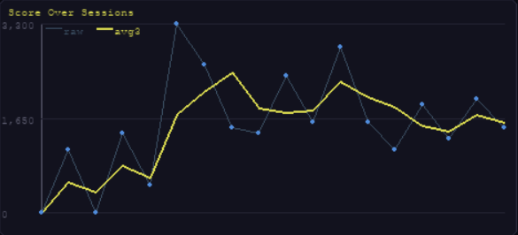
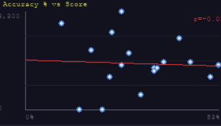
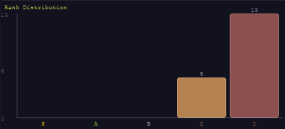
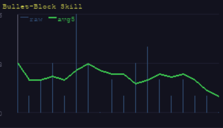

# Data Visualisation — Pixel Shot

This document describes all data-related components in Pixel Shot's statistics dashboard. The dashboard is accessible from the main menu via the **STATS** button and reads data from `data/sessions.csv`, which is automatically updated at the end of every session.

---

## Overall Dashboard

The statistics dashboard is a single-page Pygame-rendered screen divided into multiple panels. It displays a session history table and four charts that collectively describe how the player's skill and behaviour evolve across sessions. The screen supports mouse-wheel scrolling to reveal older session rows. All data is read directly from the CSV file, so the dashboard always reflects the most up-to-date recorded sessions without any manual refresh.

---

## Component 1: Session History Table

The session history table lists every recorded gameplay session with columns for Session ID, Timestamp, Shots Fired, Accuracy (%), Kills, Bullet Blocks, Dash Count, Slow-time Uses, Deaths, Completion Time, Pixels Moved, Score, and Rank (S/A/B/C/D). Each row is colour-coded by rank — gold for S, green for A, grey for B, orange for C, and red for D — making it easy to identify standout sessions at a glance. This table is the primary raw-data view, letting the player trace exactly what happened in any past session.

---

## Component 2: Score Over Sessions (Line Chart)

This line chart plots the player's total score for each session in chronological order. A faint raw line shows per-session scores, while a brighter rolling-mean line (window = 3 sessions) smooths out noise to reveal whether the player is genuinely improving over time. Y-axis tick labels are drawn at three evenly-spaced intervals. This chart is most useful for identifying improvement trends — a rising rolling mean indicates that the player is learning the mechanics and scoring more consistently.

---

## Component 3: Accuracy vs Kills (Scatter Plot)

Each point in this scatter plot represents one session, with the X-axis showing accuracy (kills ÷ shots fired, in percent) and the Y-axis showing kill count. Points are colour-coded by rank. This chart reveals whether the player tends to spray bullets (low accuracy, high shots) or plays precisely (high accuracy, fewer shots). A cluster of points in the upper-right quadrant indicates both high accuracy and high kills — the ideal outcome. Outlier points (e.g., very high accuracy but low kills) suggest the player fired very few shots, possibly playing overly cautiously.

---

## Component 4: Rank Distribution (Bar Chart)

This bar chart shows how many sessions the player has achieved each rank (S, A, B, C, D), giving an at-a-glance summary of overall performance across all recorded sessions. Each bar represents one rank tier and is colour-coded consistently with the session table — gold for S, green for A, grey for B, orange for C, and red for D. A distribution skewed toward the right (S and A) reflects strong and consistent play, while a heavy D column indicates the player is still learning the scoring system. Over many sessions, watching this distribution shift leftward is one of the clearest indicators of long-term skill growth.

---

## Component 5: Bullet Blocks per Session (Line Chart)

This line chart displays the count of successful bullet-block events (player bullet intercepting an enemy bullet mid-air) per session. Bullet-blocking is one of the highest-skill actions in Pixel Shot — it simultaneously eliminates an incoming threat and awards bonus score. Sessions with higher block counts strongly correlate with higher overall scores and better ranks. A rising trend in this chart indicates that the player is developing the spatial awareness and reaction speed needed to execute this advanced mechanic consistently.
